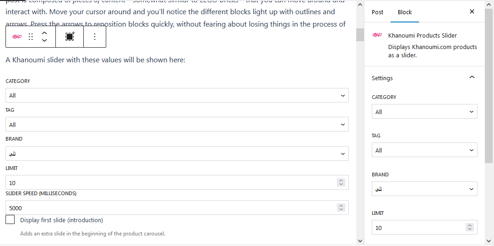
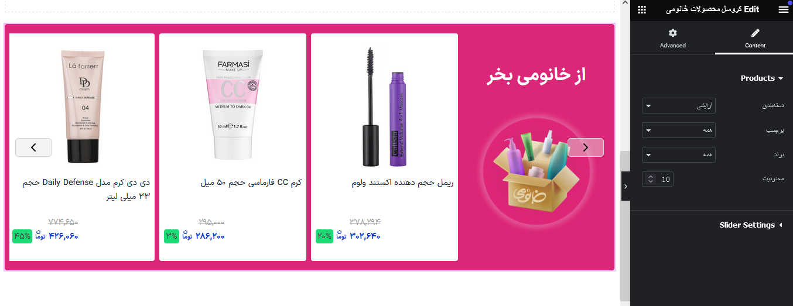
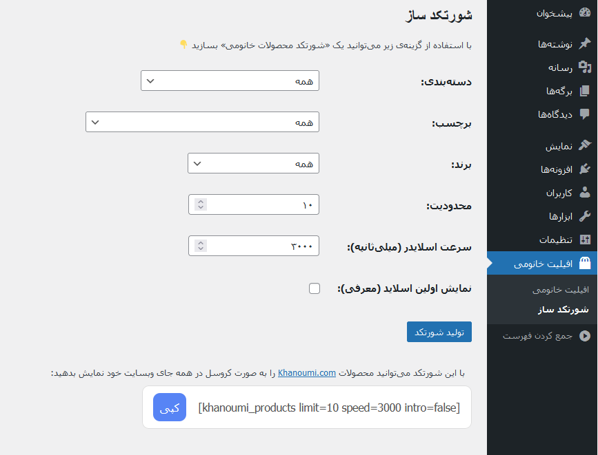
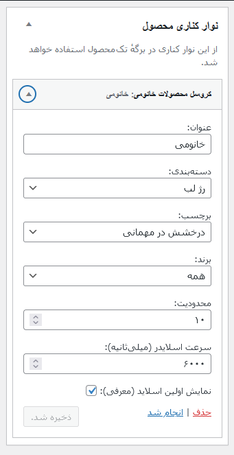

# Khanoumi Affiliate Partner Plugin
`v1.2.3` ([Changelog](CHANGELOG.md))

Fetch [Khanoumi](https://Khanoumi.com/) products and display them in your WordPress website.

## Installation

Download the latest version from the [releases page](../../releases) and install it on your WordPress site.

## How to Use
- With a Gutenberg block: 



- With an Elementor widget: 



- With a shortcode: 



- With a classic WP widget: 



## Composer Setup

Run this command in the plugin root:
```bash
$ composer install
```

## NPM Setup

Run this command in `assets/blocks/slider` folder::
```bash
$ npm install
```
